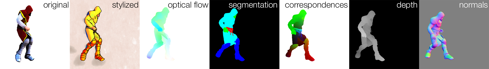
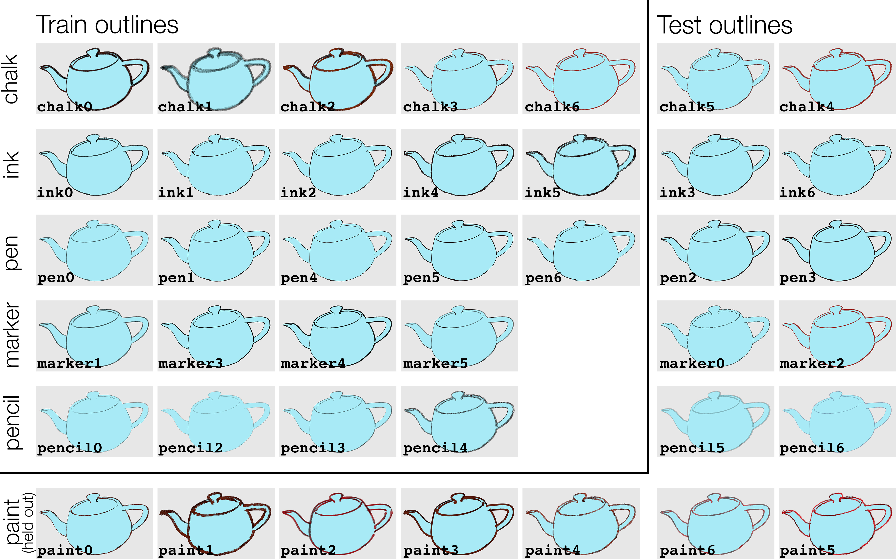

# Creative Flow+ Codebase
Code accompanying the Creative Flow+ Dataset, CVPR 2019. For paper and data downloads see [project website](http://www.cs.toronto.edu/creativeflow/).

This code can be used to:
   1. Decompress Creative Flow+ Dataset files
   2. Install and use python utilities for working with this data 
   3. Run the data generation pipeline to make your own data
   
We detail all 3 use cases below.

### 1 Decompressing Creative Flow+ Dataset

[Creative Flow+ Dataset](http://www.cs.toronto.edu/creativeflow/) is provided as multiple zip files. The data in the zip files is further compressed using various techniques. This section explains how to unpack this data into raw images, flow files, etc.

#### Unzipping Packages
We provide different data types for the same sequences in separate downloads so that you only have to download the data you need. **IMPORTANT:** to make your life easier, unzip all your `test` download packages into the same `test` directory, and all your `train` packages into the same `train` directory. For example:

```shell
cd $CREATIVEFLOW_DATA
mkdir -p compressed/train
unzip $DOWNLOADS/train_flows_mixamo_halfres.zip -d compressed/train
unzip $DOWNLOADS/train_renders_mixamo_halfres.zip -d compressed/train
unzip $DOWNLOADS/train_flows_shapenet_halfres.zip -d compressed/train
unzip $DOWNLOADS/train_renders_shapenet_halfres.zip -d compressed/train

mkdir -p compressed/test
unzip $DOWNLOADS/test_flows_halfres.zip -d compressed/test
unzip $DOWNLOADS/test_renders_halfres.zip -d compressed/test
```

#### Running Decompression

Once the downloads are unzipped, data must be further decompressed into images/flow files/etc. First, make sure to install all requirements, e.g. into `virtualenv` (use python3):
```shell script
pip install -r requirements.pip
```

Then use our decompression utility: 
```bash
cd creativeflow/creativeflow

# Run with -h to see configuration options
./datagen/pipeline_decompress.sh -h
```

If you unzipped flow and rendering packages as shown above, you will need to run `pipeline_decompress.sh` once for `compressed/test` and once for `compressed/train` directories. For example, if you require decompressed occlusions (`o`), flows (`f`),  original (`r`) and stylized composited (`C`) renderings, you will need to specify flags `-m ofr -r C`:
```shell script
cd creativeflow/creativeflow

for X in "test" "train"; do
    mkdir -p $CREATIVEFLOW_DATA/decompressed/$X
    ./datagen/pipeline_decompress.sh \
      -m ofr -r C -o $CREATIVEFLOW_DATA/decompressed/$X \
      $CREATIVEFLOW_DATA/compressed/$X
done
```

#### About Data Format
Please refer to the [Errata & Details](http://www.cs.toronto.edu/creativeflow/files/2596-errata.pdf) document linked from [our website](http://www.cs.toronto.edu/creativeflow/).

### 2 Installing and Using Python Utilities
We recommend using our python utilities to navigate the Creative Flow+ Dataset: 
  * `creativeflow.blender.dataset_util`: help with dataset paths
  * `creativeflow.blender.io_util`: help with I/O
  * `creativeflow.blender.flow_util`: flow-specific utilities

Note that the bulk of the python code in this repository can only run inside Blender, and only these three modules can be installed independently. 

#### Installing
To test and install (use python3):
```console
cd creativeflow

# run unit tests
python setup.py test

# install
pip install -e .
```

#### Using

To navigate files in a [decompressed](#running-decompression) dataset, download `sequence_list.txt` files from the [Creative Flow+ Website](http://www.cs.toronto.edu/creativeflow/). Then, to read training examples:
```python
from creativeflow.blender.dataset_util import DatasetHelper
from creativeflow.blender.dataset_util import ShadingStyles
from creativeflow.blender.dataset_util import DataType

import creativeflow.blender.flow_util as flow_util
import creativeflow.blender.io_util as io_util

# create a helper to turn sequence list into paths
# (if filtering by style, scroll down to see named style diagrams)
helper = DatasetHelper(
  seq_list_file, 
  require_flow=True,
  regex_sources='web|mixamo',
  regex_shading_styles=ShadingStyles.stylit_styles_regex(),
  regex_line_styles='pen')

# check that all the files you need exist (run once)
helper.check_files(
  base_dir,
  [DataType.FLOW, DataType.RENDER_COMPOSITE, DataType.ALPHA])

# Option 1: read samples from the dataset by iterating global frame numbers
for global_frame in range(helper.num_frames_in_all_styles()):
  # Get sequence, style, frame indices
  seq, style_idx, frame_idx = helper.get_sequence_info(global_frame)
  
  # Get paths for data of interest
  flow_path = seq.get_meta_path(
      DataType.FLOW, frame_idx,
      base_dir=base_dir)
  frame0_path = seq.get_render_path(
      DataType.RENDER_COMPOSITE, style_idx, frame_idx,
      base_dir=base_dir)
  frame1_path = seq.get_render_path(
      DataType.RENDER_COMPOSITE, style_idx, frame_idx + 1,
      base_dir=base_dir)

  # Read the data
  flow = io_util.read_flow(flow_path)
  # etc.

# Option 2: can also iterate over sequences, styles, frames
for seq_id in range(helper.num_sequences()):
  seq = helper.sequences[seq_id]
  for style_idx in range(seq.nstyles()):
    for frame_idx in range(seq.nframes):
      flow_path = seq.get_meta_path(
          DataType.FLOW, frame_idx,
          base_dir=base_dir)
      frame0_path = seq.get_render_path(
          DataType.RENDER_COMPOSITE, style_idx, frame_idx,
          base_dir=base_dir)
      # etc.
```


### 3 Data Generation Pipeline
We provide python code compatible with Blender 2.79 API, bash scripts and style assets that can be used to generate your own stylized data with ground truth optical flow, depth, normals, correspondences and object labels. *Note that our pipeline also renders the blends in their original style and can be used even if stylization utilities are not needed by selecting stages of interest when configuring the script.*

#### Requirements
1. Install Blender 2.79 (version is important!) and ensure it is available via shell command `blender`. 

2. Install OpenEXR library, e.g. on Mac `brew install openexr` or linux `apt-get install libopenexr-dev`. Other native requirements will be checked by the regression test
(see below).

3. Install python dependencies (use python3): `pip install -r requirements.pip`. You may want to create a virtualenv and activate it first: `python3 -m venv cfenv; source cfenv/bin/activate`.

4. Some styles generated by our pipeline rely on "Stylit: example-based stylization of 3D renderings", Fišer et al, SIGGRAPH 2016. The binary for the [stylit algorithm](http://stylit.org/) that can run non-interactively from the command line is **not publicly available**. Without it, our code can create only Blender-based styles (see image above). You may be able to obtain a binary for research purposes from the authors of that work, or use a [newer faster version of stylit](https://dcgi.fel.cvut.cz/home/sykorad/styleblit.html). When available, stylit binary should be exported as shell environment variable `STYLIT_BINARY`.

#### Required Input
Our pipeline generates stylized videos with ground truth annotation using the following inputs:
1. Animated blend files.
2. Background images (we use our own test/train split of the [BAM dataset](https://bam-dataset.org/)).
3. Material and line styles saved in a blend file (we provide `creativeflow/assets/train/styles.blend` and  `creativeflow/assets/test/styles.blend`)
4. (optional) Carefully preprocessed hand-drawn style exemplars for stylit (we provide `assets/train/stylit_styles/` and `assets/test/stylit_styles/`)
5. (optional) Crowd-sourced color combinations to make random color assignments more representative of choices human animators would make (we provide `assets/train/colors.txt` and `assets/test/colors.txt`)

Our blender-based python scripts offer some assistance in creating your animated blend files (1). E.g., you may be able to adapt `animate_main.py`, `create_corresp_blends_main.py` and `retarget_main.py` to suit your purpose.

#### Testing Your Set Up
To test local set up, run the regression test:
```bash
cd creativeflow/creativeflow

# See how to set custom test options, e.g. output dir
./tests/pipeline_regression_test.sh -h

# Actually run the test
./tests/pipeline_regression_test.sh
```

#### Data Generation Pipeline
Data generation is a single configurable script, broken down into 16 individual stages. Regression test (above) runs this script using test blends provided and gives a good starting point for configuring your command.
```bash
cd creativeflow/creativeflow

# See pipeline script help
./datagen/pipeline.sh -h

# Run pipeline (see examples in tests/pipeline_regression_test.sh)
./datagen/pipeline.sh <YOUR FLAGS>
```

### Appendix: Named Styles

Refer to these images to identify style appearance by name.

#### Shading Styles


#### Line Styles
